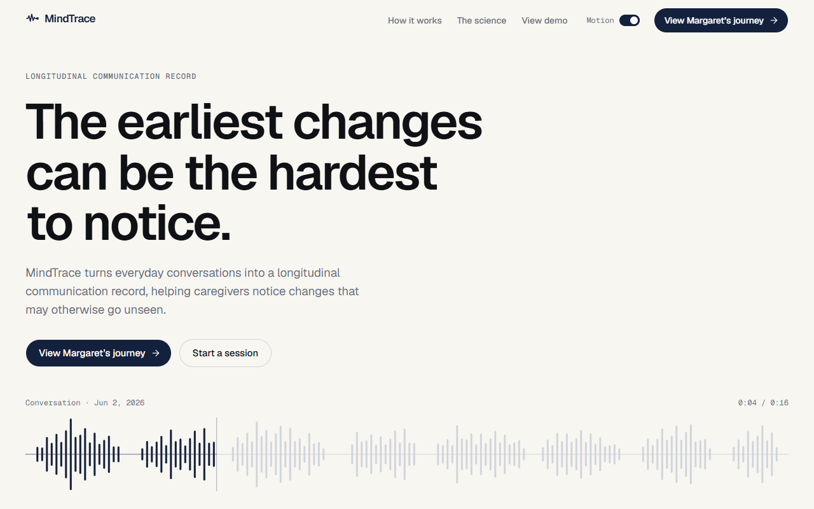
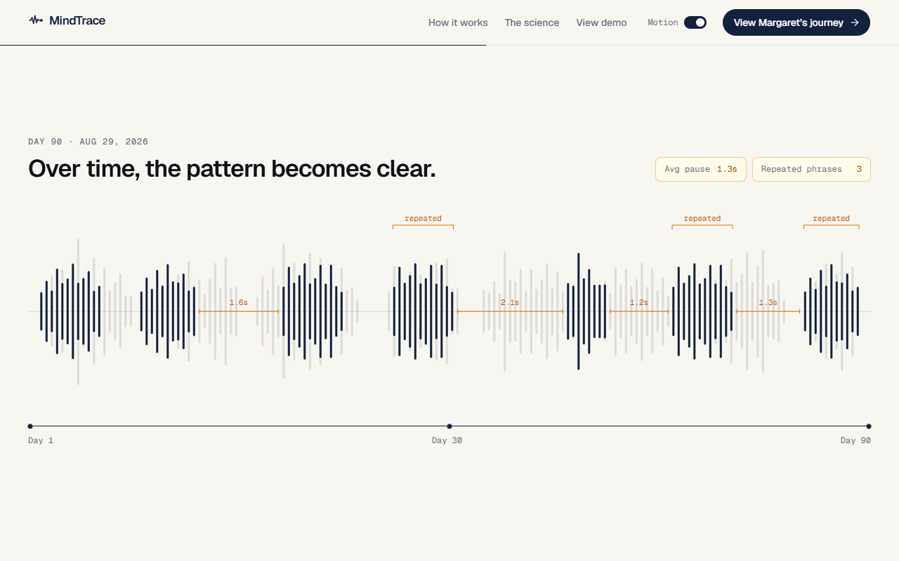
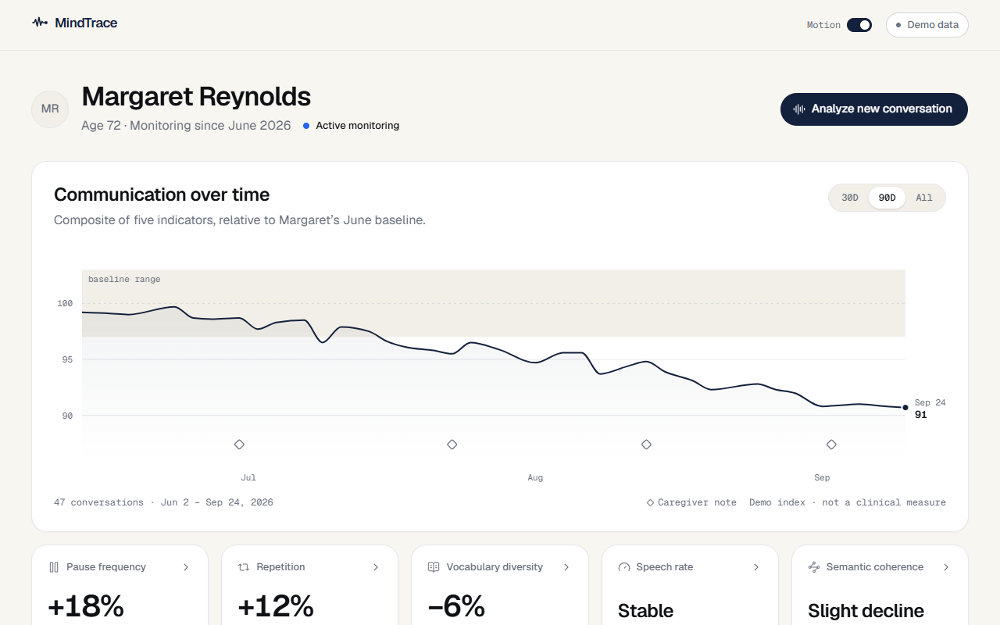
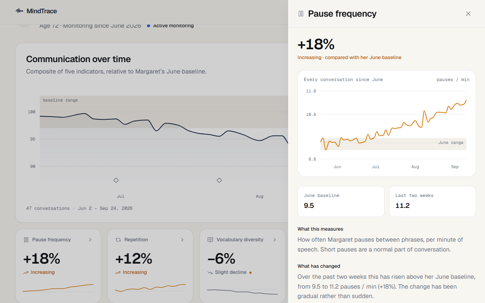
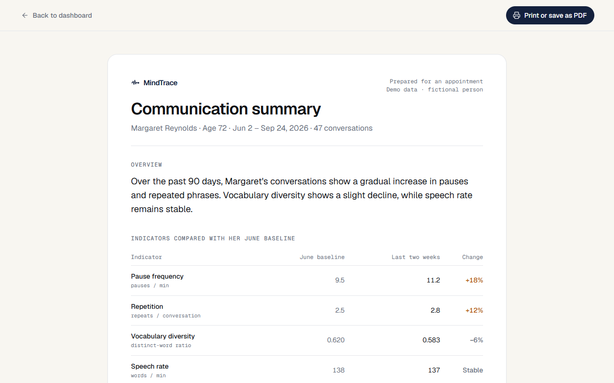

# MindTrace

**Communication, over time.** MindTrace turns everyday conversations into a longitudinal communication record, so caregivers can notice gradual changes (pauses, repetition, vocabulary, speech rate, coherence) that are easy to miss day to day.

MindTrace compares each person only with their own baseline. **It does not diagnose any condition.** It helps caregivers notice changes worth discussing with a qualified healthcare professional.



> **Demo build.** Margaret Reynolds is a fictional person and every value in this app is synthetic, generated deterministically in `src/lib/demo/margaret.ts`. Recording, transcription and analysis are not built yet ("Start a session" and "Analyze new conversation" show a placeholder).

## What's in the demo

**Landing page (`/`)**

- A hero with Margaret's Day 1 conversation as a live, speech-like waveform.
- A scroll story: the hero waveform glides into a pinned stage and changes from Day 1 to Day 30 to Day 90 as you scroll, with pauses, repeated phrases and a faint Day 1 "ghost" for comparison.
- The real dashboard, scaled into a frame that tilts into view.
- "The science": the five indicators, each with a small animated diagram.

**Dashboard (`/dashboard`)**

- A composite communication index against Margaret's June baseline band (30D / 90D / All).
- Five indicator cards. Click one for its full history, June range and a plain-language reading.
- Recent conversations. Select one to find it on the chart.
- Caregiver notes, shown as markers on the chart.
- A 90-day summary, and a printable appointment summary at `/dashboard/summary`.

| Scroll story | Dashboard |
| --- | --- |
|  |  |
| **Indicator detail** | **Appointment summary** |
|  |  |

## Run it locally

Requires Node.js 20 or newer.

```bash
cd mindtrace
npm install
npm run dev
```

Then open http://localhost:3000.

| Script | What it does |
| --- | --- |
| `npm run dev` | Development server with hot reload |
| `npm run build` | Production build (all pages are static) |
| `npm run start` | Serve the production build |
| `npm run lint` | ESLint |

### The Motion switch

The top bar has a **Motion** switch. It starts from the device's "reduce motion" setting (Windows: *Settings → Accessibility → Visual effects → Animation effects*). Turn it on to run every animation during a demo, even on a machine that asks for reduced motion. The choice is remembered in that browser.

### Share previews

Link previews use a generated image (`src/app/opengraph-image.tsx`). When deploying, set `NEXT_PUBLIC_SITE_URL` to the site's public URL so previews resolve correctly.

## Tech stack

- Next.js 16 (App Router), React 19, TypeScript
- Tailwind CSS v4, shadcn/ui on Base UI
- Motion (animation), Lenis (smooth scrolling), Recharts (charts)

## Project layout

```
src/
  app/                  routes: landing, dashboard, dashboard/summary, icons, share image
  components/
    landing/            hero, scroll story, preview, science section, nav
    dashboard/          chart, metric cards and detail panel, conversations, notes
    summary/            printable summary pieces
    shared/, providers/ buttons, reveal, Motion switch, smooth scroll
  lib/
    demo/margaret.ts    all synthetic demo data (single source of truth)
    waveform.ts         seeded speech-envelope generator
docs/
  phase1-plan.md        original design and build plan
  screenshots/          images used in this README
```
